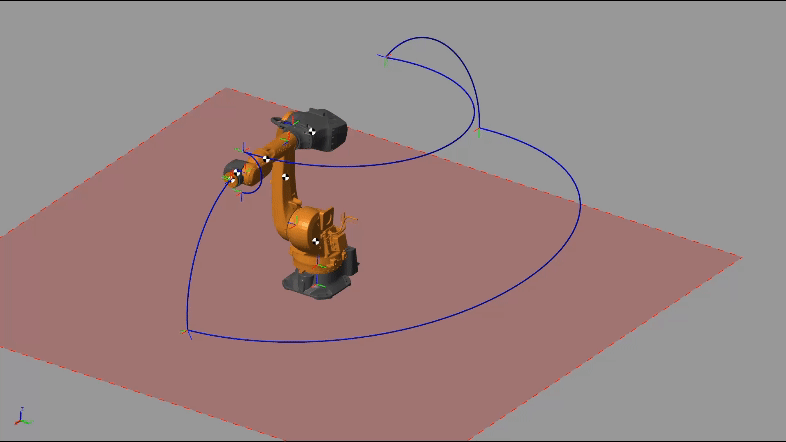

<h1> Hey! Nice to see you.</h1>

Welcome to my GitHub!
I'm Ronald,hardware and software developer from Perú, currently living in the city of Lima; In this repository you can find Automation, robotics, AI, IoT projects.

  
  
  

<h3><picture></picture>Tech Stack</h3>

&nbsp;
&nbsp;
&nbsp;
&nbsp;
&nbsp;
&nbsp;

<h3>💾 Databases</h3>

<h3>🧰 Version Controll & Tools</h3>

<h3>My GitHub Stats</h3>

<picture></picture>

 

  
  
  
  
  
  

&nbsp;

